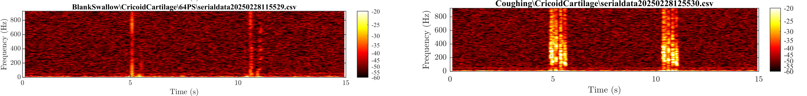
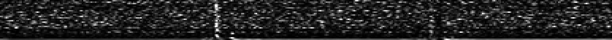
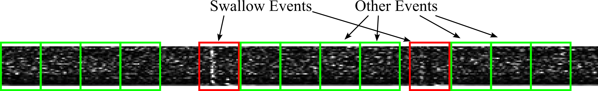

# Classification NN for Piezoelectric Swallow Sensor
 
This folder contains scripts for training a classification NN to distringuish between piezoelectric sensor recordings (attached to the throat) for swallows and other events. As a starting point I have used an examples script [1] for classifying the Fashion-MNIST dataset [2] in python using keras.

### Data format
In order for image classification to work, we first need to extract useful information from the recordings as 3d arrays. For this purpose I process the raw data (voltage over time) into STFT spectrograms in Matlab, where the difference between swallow events and others can clearly be seen.

In order to be analagous to Fashion-MNIST networks, I have processed the data into 28x28 grayscale images spanning 1 second of the recordings - n examples of swallows and m others. To do this, I first convert the 15s spectrogram into a 28x420 grayscale image to be divided up.

By passing the timestamp of each swallow event in that particular recording, I divide the recording into a number of 28x28 segments - 2 swallow events per recording and many more others.

### Labels
Each training and test example is assigned to one of the following labels:

| Label | Description |
| --- | --- |
| 0 | Swallow |
| 1 | Other |

### References
[1] geeksforgeeks.org. [Fashion MNIST with Python Keras and Deep Learning]([https://www.geeksforgeeks.org/fashion-mnist-with-python-keras-and-deep-learning/]).  
[2] H. Xiao,  K. Rasul, R. Vollgraf. [Fashion-MNIST]([https://github.com/zalandoresearch/fashion-mnist]).  
