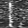

# Classification NN for Piezoelectric Swallow Sensor
 
This folder contains scripts for training a classification NN to distringuish between piezoelectric sensor recordings (attached to the throat) for swallows and other events. The data is processed into an image dataset in MATLAB, and for ML I have started from an example script for classifying the Fashion-MNIST dataset in python using keras [1,2].

### Data formatting
In order for image classification to work, we first need to extract useful information from the recordings in image format. For this purpose I process the raw data (voltage over time) into STFT spectrograms in Matlab, where the difference between swallow events and others can clearly be seen.

In order to be analagous to the Fashion-MNIST dataset, I process the data into 28x28 grayscale images each spanning 1 second of a recording - n examples of swallows and m others. To do this, I first convert the 15s spectrogram into a 28x420 grayscale image to be divided up:

By passing the timestamp of each swallow event in that particular recording, I divide the recording into a number of 28x28 segments - 2 swallow events per recording and many more others:

The 36 blank swallows are shown here:

### Labels
Each training and test example is assigned a label:

| Label | Description |
| --- | --- |
| 0 | Other |
| 1 | Swallow |

### References
[1] geeksforgeeks.org. 2023. [Fashion MNIST with Python Keras and Deep Learning](https://www.geeksforgeeks.org/fashion-mnist-with-python-keras-and-deep-learning/).  
[2] H. Xiao,  K. Rasul, R. Vollgraf. 2017. [Fashion-MNIST](https://github.com/zalandoresearch/fashion-mnist).  
